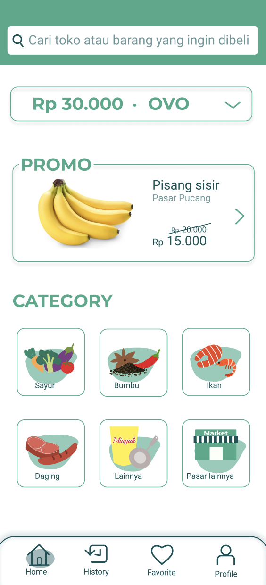

# 🛒 MIX MARKET

---
 
This is my UX course project I did with my team back then when I was in university.
You can check the full version on [my figma](https://www.figma.com/file/2r0d5ahfAzmbIaLP5F70Pt/Project-UX?type=design&node-id=0%3A1&mode=design&t=LmaEM1rftGUAPfYc-1).

 
There are few steps to take before we make the high fidelity design of <em>mix market</em> app.

### The Problem

---

At this stage, my team and I brainstormed about what was our problem in this modern and developed era. We realized that in this modern and developed era, our people also build a business, a small and medium enterprise. However, because they usually built their business at home or in a place where it is hard to reach so we are going to be their bridge, from seller to user.

  
### Also.. We built our icons too!

---

Since we want to make this project special, we built the icons, logo and many more.. you can check in the figma 

Image above is one of the icon we made.
  

In addition, we also made the navbar icon.
